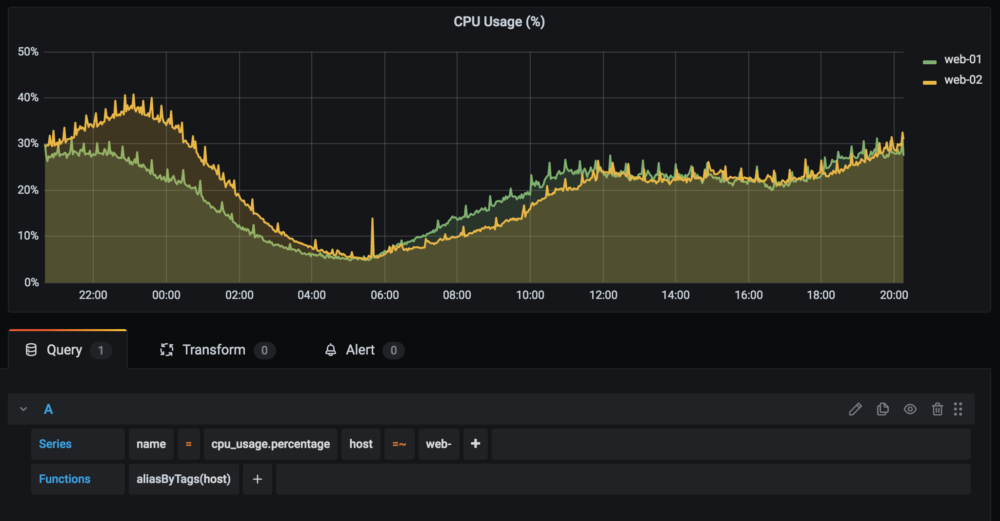

[](https://opensource.org/licenses/MIT)

## Overview
Python exporter to query InfluxDB time-series data (metrics) and send it to Graphite

## Example output
```
cpu_usage.percentage;source=influx;type=metrics;host=web-01 24.8838690979267656 1615126560
cpu_usage.percentage;source=influx;type=metrics;host=web-01 24.0335208843264954 1615126620

cpu_usage.percentage;source=influx;type=metrics;host=web-02 21.071634856923237 1615126560
cpu_usage.percentage;source=influx;type=metrics;host=web-02 21.457512108611479 1615126620

mem_usage.percentage;source=influx;type=metrics;host=web-01 31.57099500510103 1615126560
mem_usage.percentage;source=influx;type=metrics;host=web-01 31.80944142388885 1615126620

mem_usage.percentage;source=influx;type=metrics;host=web-02 25.474647153772106 1615126560
mem_usage.percentage;source=influx;type=metrics;host=web-02 25.67828499917238 1615126620

Metrics sent for: 2 queries
```

## Grafana Graph (Graphite)


## Dependencies
- Python v3.6
- InfluxDB endpoint should be accessible
- Graphite v1.1.x or higher (if you want to use tagged series)
- Carbon should be accessible on plaintext port

## Configuration
This exporter can be run as a cronjob to fetch InfluxDB data on a regular interval

## License
Code released under the [MIT License](https://opensource.org/licenses/MIT)